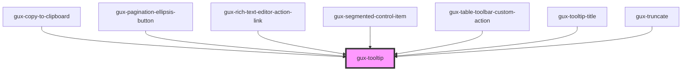

# gux-tooltip

This custom component is a simple tooltip.

When hovering a node, the tooltip will be shown below.

If there is not enough space on the bottom, or right of the component, the tooltip position will be adjusted.

## Example usage

``` html
<!-- First option (With parentElement) -->
<div>
  <button>Button</button>
  <gux-tooltip>My great tooltip</gux-tooltip>
</div>

<!-- Second option (With parent id in for attribute) -->
<button id="needs-tooltip">Button</button>
<gux-tooltip for="needs-tooltip">My great tooltip</gux-tooltip>
```

<!-- Auto Generated Below -->


## Properties

| Property    | Attribute   | Description                                                                                                | Type                                                                                                                                                                 | Default          |
| ----------- | ----------- | ---------------------------------------------------------------------------------------------------------- | -------------------------------------------------------------------------------------------------------------------------------------------------------------------- | ---------------- |
| `accent`    | `accent`    |                                                                                                            | `"dark" \| "light"`                                                                                                                                                  | `'light'`        |
| `for`       | `for`       | Indicates the id of the element the popover should anchor to. (If not supplied the parent element is used) | `string`                                                                                                                                                             | `undefined`      |
| `placement` | `placement` | Placement of the tooltip. Default is bottom-start                                                          | `"bottom" \| "bottom-end" \| "bottom-start" \| "left" \| "left-end" \| "left-start" \| "right" \| "right-end" \| "right-start" \| "top" \| "top-end" \| "top-start"` | `'bottom-start'` |


## Methods

### `hideTooltip() => Promise<void>`


#### Returns

Type: `Promise<void>`


### `showTooltip() => Promise<void>`


#### Returns

Type: `Promise<void>`


## Slots

| Slot        | Description      |
| ----------- | ---------------- |
| `"content"` | Slot for content |


## Dependencies

### Used by

 - [gux-copy-to-clipboard](../gux-copy-to-clipboard)
 - [gux-pagination-ellipsis-button](../gux-pagination/gux-pagination-buttons/gux-pagination-ellipsis-button)
 - [gux-rich-text-editor-action-link](../../beta/gux-rich-text-editor/gux-rich-text-editor-action/gux-rich-text-editor-action-link)
 - [gux-segmented-control-item](../../beta/gux-segmented-control/gux-segmented-control-item)
 - [gux-table-toolbar-custom-action](../gux-table-toolbar/gux-table-toolbar-custom-action)
 - [gux-tooltip-title](../gux-tooltip-title)
 - [gux-truncate](../gux-truncate)

### Graph


----------------------------------------------

*Built with [StencilJS](https://stenciljs.com/)*
