# gux-truncate

<!-- Auto Generated Below -->

## Properties

| Property           | Attribute           | Description                     | Type                                                                                                                                                                 | Default          |
| ------------------ | ------------------- | ------------------------------- | -------------------------------------------------------------------------------------------------------------------------------------------------------------------- | ---------------- |
| `maxLines`         | `max-lines`         | Lines to wrap before truncating | `number`                                                                                                                                                             | `undefined`      |
| `tooltipAccent`    | `tooltip-accent`    |                                 | `"dark" \| "light"`                                                                                                                                                  | `'light'`        |
| `tooltipPlacement` | `tooltip-placement` | Lines to wrap before truncating | `"bottom" \| "bottom-end" \| "bottom-start" \| "left" \| "left-end" \| "left-start" \| "right" \| "right-end" \| "right-start" \| "top" \| "top-end" \| "top-start"` | `'bottom-start'` |

## Methods

### `setHideTooltip() => Promise<void>`

#### Returns

Type: `Promise<void>`

### `setShowTooltip() => Promise<void>`

#### Returns

Type: `Promise<void>`

## Slots

| Slot | Description                                      |
| ---- | ------------------------------------------------ |
|      | text node or element containing text to truncate |

## Dependencies

### Used by

 - [gux-blank-state-beta](../../beta/gux-blank-state-beta)
 - [gux-dropdown](../gux-dropdown)
 - [gux-file-list-item](../gux-form-field/components/gux-form-field-file-beta/components/gux-file-list-item)
 - [gux-inline-dropdown-beta](../../beta/gux-inline-dropdown)
 - [gux-notification-toast-legacy](../../legacy/gux-notification-toast-legacy)
 - [gux-option](../gux-listbox/options/gux-option)
 - [gux-option-icon](../gux-listbox/options/gux-option-icon)
 - [gux-option-multi](../gux-listbox-multi/gux-option-multi)
 - [gux-option-status-beta](../../beta/gux-option-status)
 - [gux-rich-style-list-item](../../beta/gux-rich-text-editor/gux-rich-text-editor-list/gux-rich-style-list-item)
 - [gux-rich-text-editor-action-rich-style](../../beta/gux-rich-text-editor/gux-rich-text-editor-action/gux-rich-text-editor-action-rich-style)
 - [gux-rich-text-editor-action-text-highlight](../../beta/gux-rich-text-editor/gux-rich-text-editor-action/gux-rich-text-editor-action-text-highlight)
 - [gux-rich-text-editor-beta](../../beta/gux-rich-text-editor)
 - [gux-select-all](../gux-listbox-multi/gux-select-all)
 - [gux-side-panel-header](../../beta/gux-side-panel/components/gux-side-panel-header)
 - [gux-side-panel-heading](../../beta/gux-side-panel/components/gux-side-panel-heading)
 - [gux-simple-toast-legacy](../../legacy/gux-simple-toast-legacy)
 - [gux-step](../../beta/gux-stepper/gux-step)
 - [gux-step-title](../../beta/gux-stepper/gux-step/gux-step-title)
 - [gux-toast](../gux-toast)

### Depends on

- [gux-tooltip](../gux-tooltip)

### Graph

```mermaid
graph TD;
  gux-truncate --> gux-tooltip
  gux-blank-state-beta --> gux-truncate
  gux-dropdown --> gux-truncate
  gux-file-list-item --> gux-truncate
  gux-inline-dropdown-beta --> gux-truncate
  gux-notification-toast-legacy --> gux-truncate
  gux-option --> gux-truncate
  gux-option-icon --> gux-truncate
  gux-option-multi --> gux-truncate
  gux-option-status-beta --> gux-truncate
  gux-rich-style-list-item --> gux-truncate
  gux-rich-text-editor-action-rich-style --> gux-truncate
  gux-rich-text-editor-action-text-highlight --> gux-truncate
  gux-rich-text-editor-beta --> gux-truncate
  gux-select-all --> gux-truncate
  gux-side-panel-header --> gux-truncate
  gux-side-panel-heading --> gux-truncate
  gux-simple-toast-legacy --> gux-truncate
  gux-step --> gux-truncate
  gux-step-title --> gux-truncate
  gux-toast --> gux-truncate
  style gux-truncate fill:#f9f,stroke:#333,stroke-width:4px
```

----------------------------------------------

*Built with [StencilJS](https://stenciljs.com/)*
