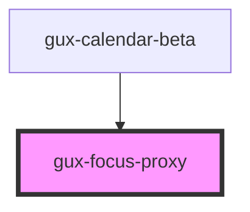

# gux-focus-proxy

<!-- Auto Generated Below -->

## Overview

A utility component that just renders it's content, delegating focus. Useful
when a parent needs to control the focus state of slotted elements, typically
to enable internal navigation of focus via arrow keys within a composite
component that acts a single focus target, such as a dropdown or calendar.
Example snippet:

  <gux-focus-proxy tabindex={item.isCurrentFocus ? '0' : '-1'}>
   <slot name="external-button"></slot>
  </gux-focus-proxy>

This would let the user slot a button or interactive component via the named
slot (e.g. <button name="external-button">) but the tabindex will remove the
slotted button from tab order unless the current item is flagged as focused.

## Dependencies

### Used by

 - [gux-calendar-beta](../../beta/gux-calendar-beta/components/single)

### Graph

----------------------------------------------

*Built with [StencilJS](https://stenciljs.com/)*
