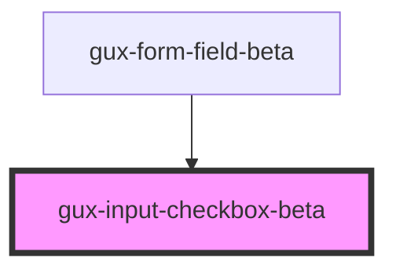

# gux-checkbox

This component represents a checkbox with three possible states: `unchecked`, `checked`, and `indeterminate`.  The third state, `indeterminate`, is intended to represent when a checkboxes state is 'mixed', often when a checkbox has child items.

## Usage Examples

### Standard Checkboxes

```
<gux-checkbox checked>An unchecked checkbox</gux-checkbox>
<gux-checkbox checked>A checked checkbox</gux-checkbox>
```

### Indeterminate Checkboxes

```
<gux-checkbox class="parent" indeterminate>

<!-- NOTE: The gux-checkboxes don't actually interact with eachother, so you need to add your own logic to update the state of the parent checkbox>
<div class="children">
  <gux-checkbox checked>An unchecked checkbox</gux-checkbox>
  <gux-checkbox checked>A checked checkbox</gux-checkbox>
</div>
```

<!-- Auto Generated Below -->


## Slots

| Slot      | Description                              |
| --------- | ---------------------------------------- |
| `"input"` | Required slot for input[type="checkbox"] |
| `"label"` | Required slot for label                  |


## Dependencies

### Used by

 - [gux-form-field-beta](../..)

### Graph


----------------------------------------------

*Built with [StencilJS](https://stenciljs.com/)*
