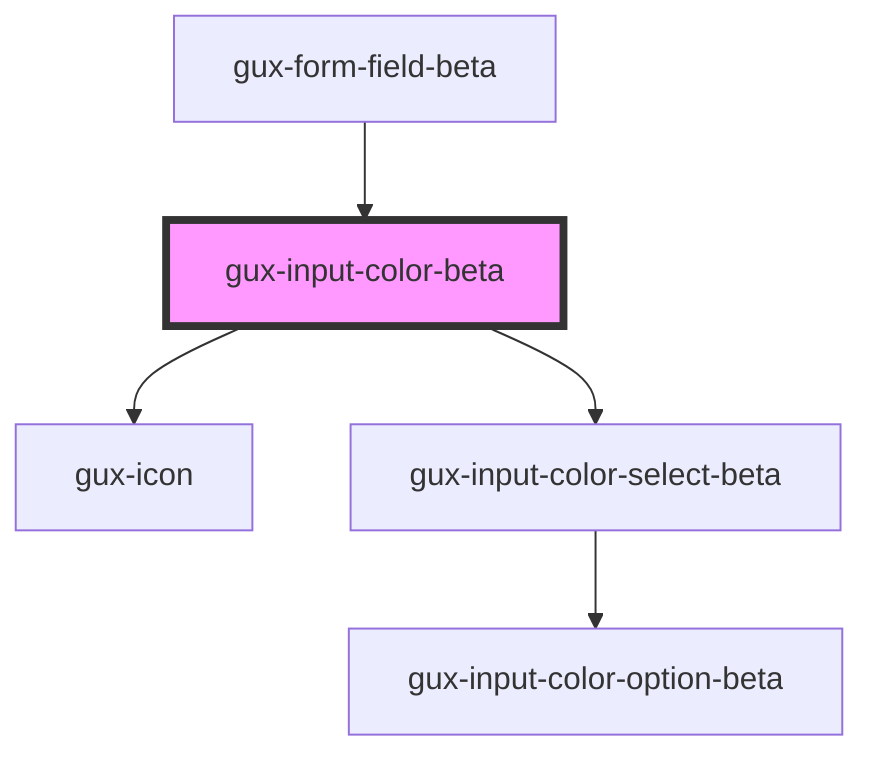

# gux-color-picker

<!-- Auto Generated Below -->

## Slots

| Slot      | Description                           |
| --------- | ------------------------------------- |
| `"input"` | Required slot for input[type="color"] |

## Dependencies

### Used by

 - [gux-form-field-beta](../..)

### Depends on

- [gux-icon](../../../../../stable/gux-icon)
- [gux-input-color-select-beta](../gux-input-color/components/gux-color-select-beta)

### Graph

----------------------------------------------

*Built with [StencilJS](https://stenciljs.com/)*
