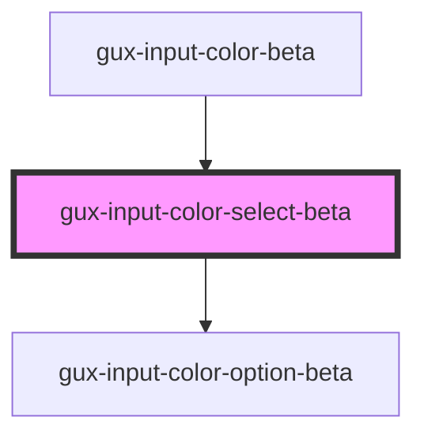

# gux-color-select

<!-- Auto Generated Below -->

## Slots

| Slot      | Description                           |
| --------- | ------------------------------------- |
| `"input"` | Required slot for input[type="color"] |

## Dependencies

### Used by

 - [gux-input-color-beta](../../../gux-input-color-beta)

### Depends on

- [gux-input-color-option-beta](../gux-input-color-option-beta)

### Graph

----------------------------------------------

*Built with [StencilJS](https://stenciljs.com/)*
