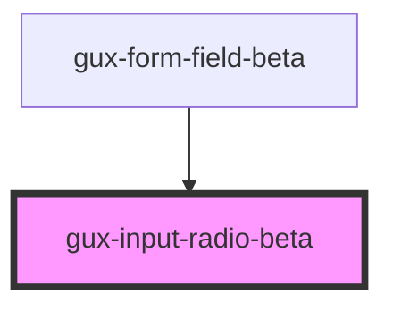

# gux-radio

A radio button component, intended to be used in conjunction with the `gux-radio-group` component.  Labels should be provided through the component's main slot.

## Example Usage

See documentation for the `gux-radio-group` documentation for a more thourough example.

```
<gux-radio value="pizza">I like pizza!</gux-radio>
```

<!-- Auto Generated Below -->


## Slots

| Slot      | Description                           |
| --------- | ------------------------------------- |
| `"input"` | Required slot for input[type="radio"] |
| `"label"` | Required slot for label               |


## Dependencies

### Used by

 - [gux-form-field-beta](../..)

### Graph


----------------------------------------------

*Built with [StencilJS](https://stenciljs.com/)*
