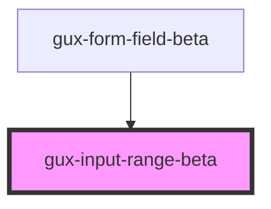

# gux-range

<!-- Auto Generated Below -->

## Slots

| Slot      | Description                           |
| --------- | ------------------------------------- |
| `"input"` | Required slot for input[type="range"] |
| `"label"` | Required slot for label               |

## Dependencies

### Used by

 - [gux-form-field-beta](../..)

### Graph

----------------------------------------------

*Built with [StencilJS](https://stenciljs.com/)*
