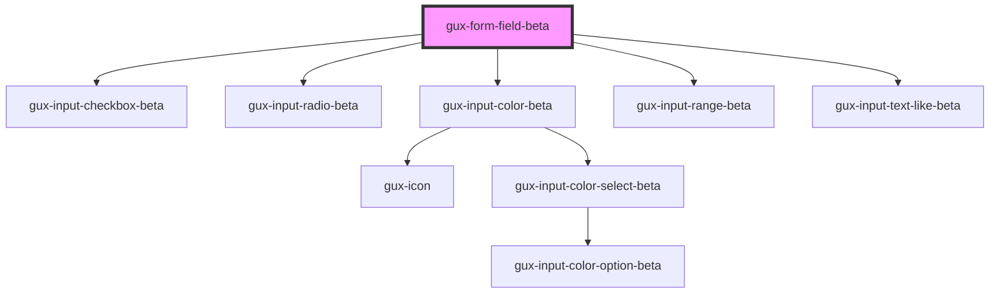

# gux-input

<!-- Auto Generated Below -->

## Slots

| Slot      | Description                 |
| --------- | --------------------------- |
| `"input"` | Required slot for input tag |
| `"label"` | Required slot for label tag |

## Dependencies

### Depends on

- [gux-input-checkbox-beta](./components/gux-input-checkbox-beta)
- [gux-input-radio-beta](./components/gux-input-radio-beta)
- [gux-input-color-beta](./components/gux-input-color-beta)
- [gux-input-range-beta](./components/gux-input-range-beta)
- [gux-input-text-like-beta](./components/gux-input-text-like-beta)

### Graph

----------------------------------------------

*Built with [StencilJS](https://stenciljs.com/)*
