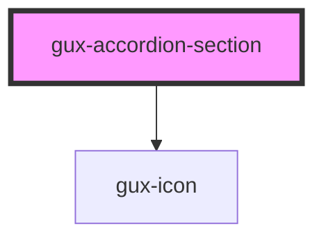

# gux-accordion

<!-- Auto Generated Below -->

## Properties

| Property        | Attribute        | Description | Type                         | Default     |
| --------------- | ---------------- | ----------- | ---------------------------- | ----------- |
| `arrowPosition` | `arrow-position` |             | `"beside-text" \| "default"` | `'default'` |

## Methods

### `close() => Promise<void>`

#### Returns

Type: `Promise<void>`

### `open() => Promise<void>`

#### Returns

Type: `Promise<void>`

### `toggle() => Promise<void>`

#### Returns

Type: `Promise<void>`

## Dependencies

### Depends on

- [gux-icon](../../../stable/gux-icon)

### Graph

----------------------------------------------

*Built with [StencilJS](https://stenciljs.com/)*
