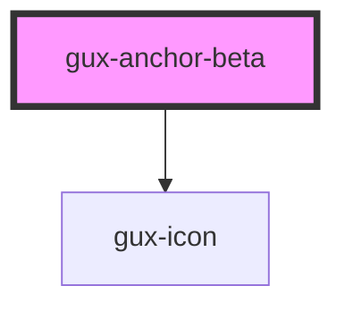

# gux-link

<!-- Auto Generated Below -->

## Properties

| Property | Attribute | Description                                            | Type      | Default |
| -------- | --------- | ------------------------------------------------------ | --------- | ------- |
| `table`  | `table`   | True when anchor component is used within a table cell | `boolean` | `false` |

## Dependencies

### Depends on

- [gux-icon](../../stable/gux-icon)

### Graph

----------------------------------------------

*Built with [StencilJS](https://stenciljs.com/)*
