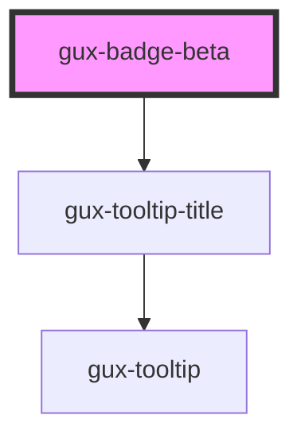

# gux-badge-beta

<!-- Auto Generated Below -->

## Properties

| Property | Attribute | Description             | Type                                        | Default     |
| -------- | --------- | ----------------------- | ------------------------------------------- | ----------- |
| `bold`   | `bold`    | Bold badge.             | `boolean`                                   | `false`     |
| `color`  | `color`   | Badge background color. | `"green" \| "neutral" \| "red" \| "yellow"` | `'neutral'` |

## Dependencies

### Depends on

- [gux-tooltip-title](../../stable/gux-tooltip-title)

### Graph

----------------------------------------------

*Built with [StencilJS](https://stenciljs.com/)*
