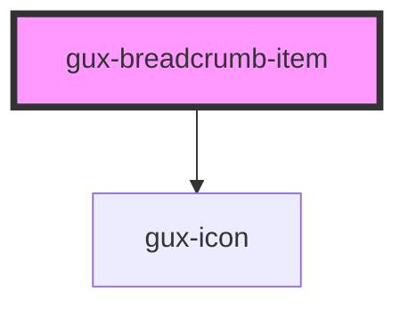

# gux-dropdown-option

<!-- Auto Generated Below -->

## Properties

| Property         | Attribute         | Description | Type      | Default     |
| ---------------- | ----------------- | ----------- | --------- | ----------- |
| `accent`         | `accent`          |             | `string`  | `undefined` |
| `href`           | `href`            |             | `string`  | `undefined` |
| `lastBreadcrumb` | `last-breadcrumb` |             | `boolean` | `undefined` |

## Dependencies

### Depends on

- [gux-icon](../../../stable/gux-icon)

### Graph

----------------------------------------------

*Built with [StencilJS](https://stenciljs.com/)*
