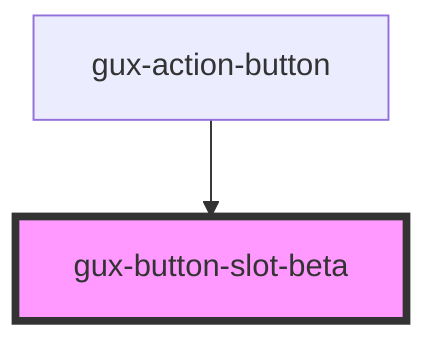

# gux-button-switch
<!-- Auto Generated Below -->

## Properties

| Property | Attribute | Description           | Type                                     | Default       |
| -------- | --------- | --------------------- | ---------------------------------------- | ------------- |
| `accent` | `accent`  | The component accent. | `"primary" \| "secondary" \| "tertiary"` | `'secondary'` |

## Slots

| Slot | Description                                                  |
| ---- | ------------------------------------------------------------ |
|      | button, input[type="button"] or input[type="submit"] element |

## Dependencies

### Used by

 - [gux-action-button](../../stable/gux-action-button)

### Graph

----------------------------------------------

*Built with [StencilJS](https://stenciljs.com/)*
