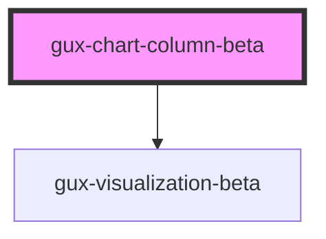

# gux-switch

## Native Events

| Event    | Description | Type               |
| -------- | ----------- | ------------------ |
| `change` |             | `InputEvent`       |
| `input`  |             | `InputEvent`       |

<!-- Auto Generated Below -->

## Properties

| Property        | Attribute        | Description | Type                              | Default     |
| --------------- | ---------------- | ----------- | --------------------------------- | ----------- |
| `chartData`     | --               |             | `{ [x: string]: unknown; }`       | `undefined` |
| `chartLayers`   | --               |             | `string[]`                        | `undefined` |
| `embedOptions`  | --               |             | `EmbedOptions<string, Renderers>` | `undefined` |
| `includeLegend` | `include-legend` |             | `boolean`                         | `undefined` |
| `legendTitle`   | `legend-title`   |             | `string`                          | `undefined` |
| `xAxisTitle`    | `x-axis-title`   |             | `string`                          | `undefined` |
| `xFieldName`    | `x-field-name`   |             | `string`                          | `undefined` |
| `yAxisTitle`    | `y-axis-title`   |             | `string`                          | `undefined` |
| `yFieldName`    | `y-field-name`   |             | `string`                          | `undefined` |

## Dependencies

### Depends on

- [gux-visualization-beta](../gux-visualization)

### Graph

----------------------------------------------

*Built with [StencilJS](https://stenciljs.com/)*
