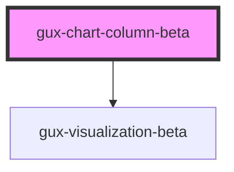

# gux-switch

## Native Events

| Event    | Description | Type               |
| -------- | ----------- | ------------------ |
| `change` |             | `InputEvent`       |
| `input`  |             | `InputEvent`       |

<!-- Auto Generated Below -->

## Properties

| Property        | Attribute        | Description                                                                                                                                                                                                              | Type                              | Default     |
| --------------- | ---------------- | ------------------------------------------------------------------------------------------------------------------------------------------------------------------------------------------------------------------------ | --------------------------------- | ----------- |
| `chartData`     | --               | Data to be rendered in the chart. Data field names must match the values you set in xFieldName and yFieldName                                                                                                            | `{ [x: string]: any; }`           | `undefined` |
| `chartLayers`   | --               | List specifying the order of optional chart layers. For correct chart layering, each chartData entry must also include a "series" field with a value indicating which layer the entry belongs to, e.g 'series': 'group1' | `string[]`                        | `undefined` |
| `embedOptions`  | --               |                                                                                                                                                                                                                          | `EmbedOptions<string, Renderers>` | `undefined` |
| `includeLegend` | `include-legend` |                                                                                                                                                                                                                          | `boolean`                         | `undefined` |
| `legendTitle`   | `legend-title`   | Title to display above the optional legend                                                                                                                                                                               | `string`                          | `undefined` |
| `xAxisTitle`    | `x-axis-title`   | Title to display along the x-axis                                                                                                                                                                                        | `string`                          | `undefined` |
| `xFieldName`    | `x-field-name`   | Name for the data field to use to populate the chart's x-axis e.g. xFieldName of "category" will map any "category" fields in chartData to the x-axis                                                                    | `string`                          | `undefined` |
| `yAxisTitle`    | `y-axis-title`   | Title to display along the y-axis                                                                                                                                                                                        | `string`                          | `undefined` |
| `yFieldName`    | `y-field-name`   | Name for the data field to use to populate the chart's x-axis e.g. yFieldName of "value" will map any "value" fields in chartData to the y-axis                                                                          | `string`                          | `undefined` |

## Dependencies

### Depends on

- [gux-visualization-beta](../gux-visualization)

### Graph

----------------------------------------------

*Built with [StencilJS](https://stenciljs.com/)*
