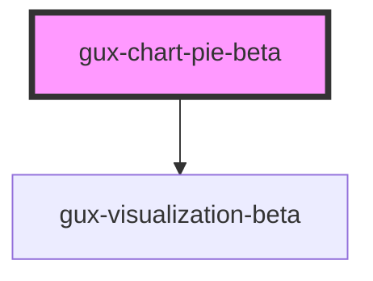

# gux-chart-donut-beta

<!-- Auto Generated Below -->

## Properties

| Property         | Attribute          | Description                                                                                                   | Type                              | Default     |
| ---------------- | ------------------ | ------------------------------------------------------------------------------------------------------------- | --------------------------------- | ----------- |
| `chartData`      | --                 | Data to be rendered in the chart. Data field names must match the values you set in xFieldName and yFieldName | `{ [x: string]: any; }`           | `undefined` |
| `colorFieldName` | `color-field-name` |                                                                                                               | `string`                          | `undefined` |
| `embedOptions`   | --                 |                                                                                                               | `EmbedOptions<string, Renderers>` | `undefined` |
| `includeLegend`  | `include-legend`   |                                                                                                               | `boolean`                         | `undefined` |
| `labelField`     | `label-field`      |                                                                                                               | `string`                          | `undefined` |
| `labelRadius`    | `label-radius`     |                                                                                                               | `number`                          | `undefined` |
| `legendTitle`    | `legend-title`     |                                                                                                               | `string`                          | `undefined` |
| `outerRadius`    | `outer-radius`     |                                                                                                               | `number`                          | `undefined` |

## Dependencies

### Depends on

- [gux-visualization-beta](../gux-visualization)

### Graph

----------------------------------------------

*Built with [StencilJS](https://stenciljs.com/)*
