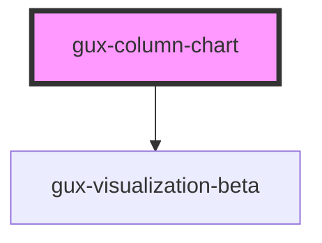

# gux-switch

## Native Events

| Event    | Description | Type               |
| -------- | ----------- | ------------------ |
| `change` |             | `InputEvent`       |
| `input`  |             | `InputEvent`       |

<!-- Auto Generated Below -->

## Properties

| Property            | Attribute    | Description | Type                                                                                                                                                                                                                                                                                                                                                                                                                                                                                                                                                                                                                                                                                                                                                                                                                                                                                                                                                                                                                                                                                                                                                                                                                                                                                                                                                                                                                                                                                                                                                                                                                                                                                                               | Default                                                                                                                                                                                                                                                                        |
| ------------------- | ------------ | ----------- | ------------------------------------------------------------------------------------------------------------------------------------------------------------------------------------------------------------------------------------------------------------------------------------------------------------------------------------------------------------------------------------------------------------------------------------------------------------------------------------------------------------------------------------------------------------------------------------------------------------------------------------------------------------------------------------------------------------------------------------------------------------------------------------------------------------------------------------------------------------------------------------------------------------------------------------------------------------------------------------------------------------------------------------------------------------------------------------------------------------------------------------------------------------------------------------------------------------------------------------------------------------------------------------------------------------------------------------------------------------------------------------------------------------------------------------------------------------------------------------------------------------------------------------------------------------------------------------------------------------------------------------------------------------------------------------------------------------------ | ------------------------------------------------------------------------------------------------------------------------------------------------------------------------------------------------------------------------------------------------------------------------------ |
| `baseChartSpec`     | --           |             | `GenericConcatSpec<NonNormalizedSpec> & TopLevelProperties<ExprRef \| SignalRef> & { $schema?: string; config?: Config<ExprRef \| SignalRef>; datasets?: Datasets; usermeta?: Dict<unknown>; } \| GenericFacetSpec<UnitSpecWithFrame<Field>, LayerSpec<Field>, Field> & TopLevelProperties<ExprRef \| SignalRef> & { $schema?: string; config?: Config<ExprRef \| SignalRef>; datasets?: Datasets; usermeta?: Dict<unknown>; } & DataMixins \| GenericHConcatSpec<NonNormalizedSpec> & TopLevelProperties<ExprRef \| SignalRef> & { $schema?: string; config?: Config<ExprRef \| SignalRef>; datasets?: Datasets; usermeta?: Dict<unknown>; } \| GenericUnitSpec<FacetedCompositeEncoding<Field>, AnyMark> & ResolveMixins & GenericCompositionLayout & FrameMixins<ExprRef \| SignalRef> & TopLevelProperties<ExprRef \| SignalRef> & { $schema?: string; config?: Config<ExprRef \| SignalRef>; datasets?: Datasets; usermeta?: Dict<unknown>; } & DataMixins \| GenericVConcatSpec<NonNormalizedSpec> & TopLevelProperties<ExprRef \| SignalRef> & { $schema?: string; config?: Config<ExprRef \| SignalRef>; datasets?: Datasets; usermeta?: Dict<unknown>; } \| LayerRepeatSpec & TopLevelProperties<ExprRef \| SignalRef> & { $schema?: string; config?: Config<ExprRef \| SignalRef>; datasets?: Datasets; usermeta?: Dict<unknown>; } \| LayerSpec<Field> & TopLevelProperties<ExprRef \| SignalRef> & { $schema?: string; config?: Config<ExprRef \| SignalRef>; datasets?: Datasets; usermeta?: Dict<unknown>; } \| NonLayerRepeatSpec & TopLevelProperties<ExprRef \| SignalRef> & { $schema?: string; config?: Config<ExprRef \| SignalRef>; datasets?: Datasets; usermeta?: Dict<unknown>; } \| Spec` | `{     $schema: 'https://vega.github.io/schema/vega-lite/v5.json',     mark: 'bar',     encoding: {       x: { field: 'category', type: 'nominal' },       y: { field: 'value', type: 'quantitative' },       tooltip: { aggregate: 'count', type: 'quantitative' }     }   }` |
| `chartData`         | `chart-data` |             | `string`                                                                                                                                                                                                                                                                                                                                                                                                                                                                                                                                                                                                                                                                                                                                                                                                                                                                                                                                                                                                                                                                                                                                                                                                                                                                                                                                                                                                                                                                                                                                                                                                                                                                                                           | `undefined`                                                                                                                                                                                                                                                                    |
| `embedOptions`      | --           |             | `EmbedOptions<string, Renderers>`                                                                                                                                                                                                                                                                                                                                                                                                                                                                                                                                                                                                                                                                                                                                                                                                                                                                                                                                                                                                                                                                                                                                                                                                                                                                                                                                                                                                                                                                                                                                                                                                                                                                                  | `undefined`                                                                                                                                                                                                                                                                    |
| `visualizationSpec` | --           |             | `GenericConcatSpec<NonNormalizedSpec> & TopLevelProperties<ExprRef \| SignalRef> & { $schema?: string; config?: Config<ExprRef \| SignalRef>; datasets?: Datasets; usermeta?: Dict<unknown>; } \| GenericFacetSpec<UnitSpecWithFrame<Field>, LayerSpec<Field>, Field> & TopLevelProperties<ExprRef \| SignalRef> & { $schema?: string; config?: Config<ExprRef \| SignalRef>; datasets?: Datasets; usermeta?: Dict<unknown>; } & DataMixins \| GenericHConcatSpec<NonNormalizedSpec> & TopLevelProperties<ExprRef \| SignalRef> & { $schema?: string; config?: Config<ExprRef \| SignalRef>; datasets?: Datasets; usermeta?: Dict<unknown>; } \| GenericUnitSpec<FacetedCompositeEncoding<Field>, AnyMark> & ResolveMixins & GenericCompositionLayout & FrameMixins<ExprRef \| SignalRef> & TopLevelProperties<ExprRef \| SignalRef> & { $schema?: string; config?: Config<ExprRef \| SignalRef>; datasets?: Datasets; usermeta?: Dict<unknown>; } & DataMixins \| GenericVConcatSpec<NonNormalizedSpec> & TopLevelProperties<ExprRef \| SignalRef> & { $schema?: string; config?: Config<ExprRef \| SignalRef>; datasets?: Datasets; usermeta?: Dict<unknown>; } \| LayerRepeatSpec & TopLevelProperties<ExprRef \| SignalRef> & { $schema?: string; config?: Config<ExprRef \| SignalRef>; datasets?: Datasets; usermeta?: Dict<unknown>; } \| LayerSpec<Field> & TopLevelProperties<ExprRef \| SignalRef> & { $schema?: string; config?: Config<ExprRef \| SignalRef>; datasets?: Datasets; usermeta?: Dict<unknown>; } \| NonLayerRepeatSpec & TopLevelProperties<ExprRef \| SignalRef> & { $schema?: string; config?: Config<ExprRef \| SignalRef>; datasets?: Datasets; usermeta?: Dict<unknown>; } \| Spec` | `undefined`                                                                                                                                                                                                                                                                    |

## Dependencies

### Depends on

- [gux-visualization-beta](../gux-visualization)

### Graph

----------------------------------------------

*Built with [StencilJS](https://stenciljs.com/)*
