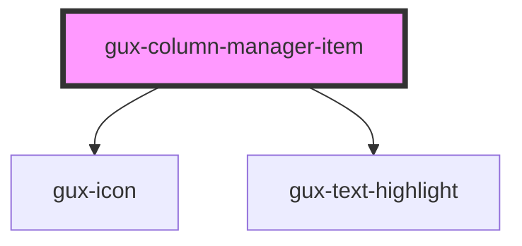

# gux-column-manager-item

<!-- Auto Generated Below -->

## Properties

| Property  | Attribute  | Description | Type     | Default     |
| --------- | ---------- | ----------- | -------- | ----------- |
| `orderId` | `order-id` |             | `string` | `undefined` |

## Events

| Event                           | Description | Type                                                   |
| ------------------------------- | ----------- | ------------------------------------------------------ |
| `internalkeyboarddoreorder`     |             | `CustomEvent<void>`                                    |
| `internalkeyboardreorderfinish` |             | `CustomEvent<void>`                                    |
| `internalkeyboardreordermove`   |             | `CustomEvent<-1 \| 1>`                                 |
| `internalkeyboardreorderstart`  |             | `CustomEvent<void>`                                    |
| `internalorderchange`           |             | `CustomEvent<{ oldIndex: number; newIndex: number; }>` |

## Methods

### `guxSetHighlight(highlight?: string, highlightActive?: boolean) => Promise<void>`

#### Returns

Type: `Promise<void>`

## Slots

| Slot | Description                      |
| ---- | -------------------------------- |
|      | slot for gux-form-field-checkbox |

## Dependencies

### Depends on

- [gux-icon](../../../stable/gux-icon)
- [gux-text-highlight](../../../stable/gux-text-highlight)

### Graph

----------------------------------------------

*Built with [StencilJS](https://stenciljs.com/)*
