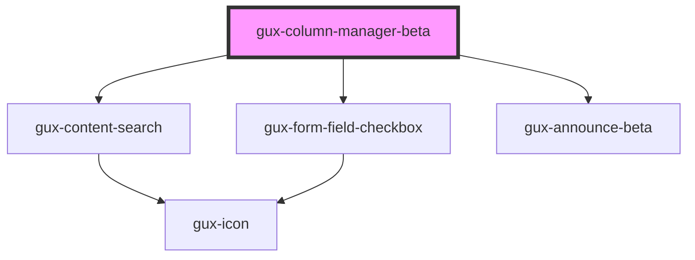

# gux-column-manager-beta

<!-- Auto Generated Below -->

## Events

| Event            | Description | Type                    |
| ---------------- | ----------- | ----------------------- |
| `guxorderchange` |             | `CustomEvent<string[]>` |

## Slots

| Slot | Description                        |
| ---- | ---------------------------------- |
|      | slot for gux-column-manager-item's |

## Dependencies

### Depends on

- [gux-content-search](../../stable/gux-content-search)
- [gux-form-field-checkbox](../../stable/gux-form-field/components/gux-form-field-checkbox)
- [gux-announce-beta](../gux-announce)

### Graph

----------------------------------------------

*Built with [StencilJS](https://stenciljs.com/)*
