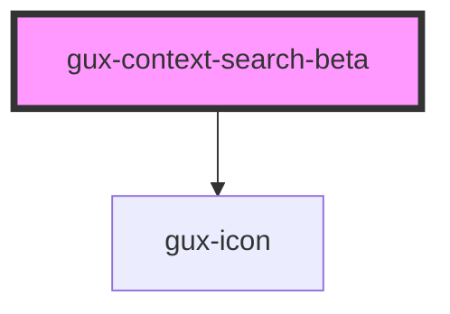

# gux-context-search-beta

<!-- Auto Generated Below -->

## Properties

| Property            | Attribute            | Description                                        | Type      | Default |
| ------------------- | -------------------- | -------------------------------------------------- | --------- | ------- |
| `currentMatch`      | `current-match`      | The Current match count which needs to highlighted | `number`  | `0`     |
| `disableNavigation` | `disable-navigation` | Disables the Next and Previous buttons.            | `boolean` | `false` |
| `matchCount`        | `match-count`        | The Match Count                                    | `number`  | `0`     |

## Events

| Event                    | Description                                | Type                  |
| ------------------------ | ------------------------------------------ | --------------------- |
| `guxcurrentmatchchanged` | Triggered when Current match value changes | `CustomEvent<number>` |

## Methods

### `clear() => Promise<void>`

Clears the input.

#### Returns

Type: `Promise<void>`

## Slots

| Slot | Description                 |
| ---- | --------------------------- |
|      | Required slot for input tag |

## Dependencies

### Depends on

- [gux-icon](../../stable/gux-icon)

### Graph

----------------------------------------------

*Built with [StencilJS](https://stenciljs.com/)*
