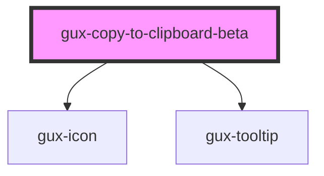

# gux-copy-to-clipboard-beta

<!-- Auto Generated Below -->

## Properties

| Property      | Attribute      | Description | Type     | Default     |
| ------------- | -------------- | ----------- | -------- | ----------- |
| `icon`        | `icon`         |             | `string` | `undefined` |
| `tooltipText` | `tooltip-text` |             | `string` | `undefined` |

## Dependencies

### Depends on

- [gux-icon](../../stable/gux-icon)
- [gux-tooltip](../../stable/gux-tooltip)

### Graph

----------------------------------------------

*Built with [StencilJS](https://stenciljs.com/)*
