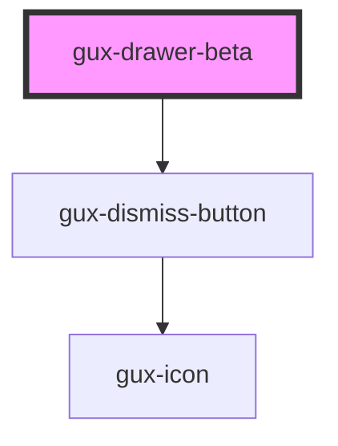

# gux-drawer-beta

<!-- Auto Generated Below -->

## Properties

| Property | Attribute | Description | Type      | Default |
| -------- | --------- | ----------- | --------- | ------- |
| `open`   | `open`    |             | `boolean` | `false` |

## Methods

### `showModal() => Promise<void>`

#### Returns

Type: `Promise<void>`

## Slots

| Slot        | Description                          |
| ----------- | ------------------------------------ |
| `"content"` | Required slot for the modal content  |
| `"title"`   | Optional slot to set the modal title |

## Dependencies

### Depends on

- [gux-dismiss-button](../../stable/gux-dismiss-button)

### Graph

----------------------------------------------

*Built with [StencilJS](https://stenciljs.com/)*
