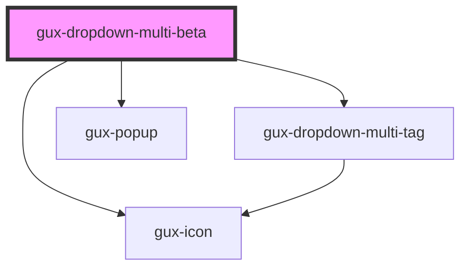

# gux-dropdown-multi

<!-- Auto Generated Below -->

## Properties

| Property      | Attribute     | Description | Type      | Default     |
| ------------- | ------------- | ----------- | --------- | ----------- |
| `disabled`    | `disabled`    |             | `boolean` | `false`     |
| `filterable`  | `filterable`  |             | `boolean` | `false`     |
| `placeholder` | `placeholder` |             | `string`  | `undefined` |
| `required`    | `required`    |             | `boolean` | `false`     |
| `value`       | `value`       |             | `string`  | `undefined` |

## Methods

### `getSelectedValues() => Promise<string[]>`

Gets the currently selected values.

#### Returns

Type: `Promise<string[]>`

## Slots

| Slot | Description                                                  |
| ---- | ------------------------------------------------------------ |
|      | for a gux-listbox-multi containing gux-option-multi children |

## Dependencies

### Depends on

- [gux-dropdown-multi-tag](gux-dropdown-multi-tag)
- [gux-icon](../../stable/gux-icon)
- [gux-popup](../../stable/gux-popup)

### Graph

----------------------------------------------

*Built with [StencilJS](https://stenciljs.com/)*
