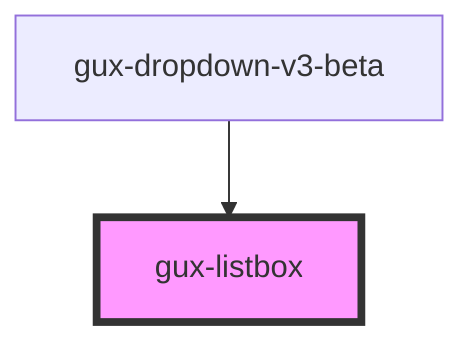

# gux-list

A list element. In order to use this element list contents must be slotted in.

Example usage

```html
<gux-list>
  <gux-listbox-item value="test" text="test1" />
  <gux-listbox-divider />
  <gux-listbox-item value="test" text="test2" />
  <gux-listbox-item value="test" text="test3" />
</gux-list>
```

Example with slotting

```html
<gux-list>
  <gux-listbox-item
    ><span>⌘</span><gux-text-highlight text="test"
  /></gux-listbox-item>
</gux-list>
```

<!-- Auto Generated Below -->


## Properties

| Property | Attribute | Description | Type     | Default     |
| -------- | --------- | ----------- | -------- | ----------- |
| `value`  | `value`   |             | `string` | `undefined` |


## Events

| Event                           | Description | Type               |
| ------------------------------- | ----------- | ------------------ |
| `internallistboxoptionsupdated` |             | `CustomEvent<any>` |


## Slots

| Slot | Description                  |
| ---- | ---------------------------- |
|      | collection of gux-option-v3s |


## Dependencies

### Used by

 - [gux-dropdown-v3-beta](..)

### Graph


----------------------------------------------

*Built with [StencilJS](https://stenciljs.com/)*
