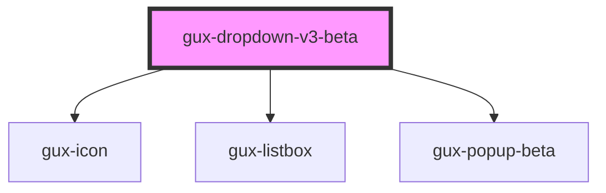

# gux-dropdown-v3-beta

<!-- Auto Generated Below -->

## Properties

| Property      | Attribute     | Description | Type      | Default     |
| ------------- | ------------- | ----------- | --------- | ----------- |
| `disabled`    | `disabled`    |             | `boolean` | `false`     |
| `placeholder` | `placeholder` |             | `string`  | `undefined` |
| `value`       | `value`       |             | `string`  | `undefined` |

## Slots

| Slot | Description               |
| ---- | ------------------------- |
|      | for list of gux-option-v3 |

## Dependencies

### Depends on

- [gux-icon](../../stable/gux-icon)
- [gux-listbox](gux-listbox)
- [gux-popup-beta](../gux-popup)

### Graph

----------------------------------------------

*Built with [StencilJS](https://stenciljs.com/)*
