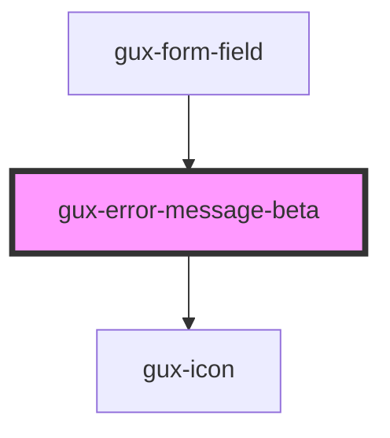

# gux-input

<!-- Auto Generated Below -->

## Slots

| Slot      | Description             |
| --------- | ----------------------- |
| `"error"` | Required slot for error |

## Dependencies

### Used by

 - [gux-form-field](../../stable/gux-form-field)

### Depends on

- [gux-icon](../../stable/gux-icon)

### Graph

----------------------------------------------

*Built with [StencilJS](https://stenciljs.com/)*
