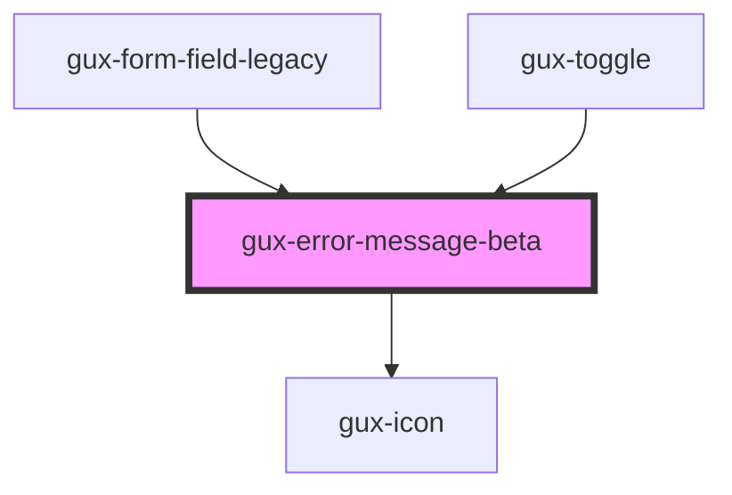

# gux-input

<!-- Auto Generated Below -->

## Slots

| Slot                           | Description             |
| ------------------------------ | ----------------------- |
| `"Required slot for message."` |                         |
| `"error(default)"`             | Required slot for error |

## Dependencies

### Used by

 - [gux-form-field-legacy](../../legacy/gux-form-field-legacy)
 - [gux-toggle](../../stable/gux-toggle)

### Depends on

- [gux-icon](../../stable/gux-icon)

### Graph

----------------------------------------------

*Built with [StencilJS](https://stenciljs.com/)*
