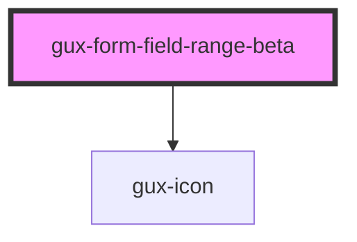

# gux-form-field-range-beta

<!-- Auto Generated Below -->

## Properties

| Property         | Attribute          | Description | Type                                    | Default     |
| ---------------- | ------------------ | ----------- | --------------------------------------- | ----------- |
| `displayUnits`   | `display-units`    |             | `string`                                | `undefined` |
| `labelPosition`  | `label-position`   |             | `"above" \| "beside" \| "screenreader"` | `undefined` |
| `valueInTooltip` | `value-in-tooltip` |             | `boolean`                               | `undefined` |

## Slots

| Slot      | Description                     |
| --------- | ------------------------------- |
| `"error"` | Optional slot for error message |
| `"input"` | Required slot for input tag     |
| `"label"` | Required slot for label tag     |

## Dependencies

### Depends on

- [gux-icon](../../../../stable/gux-icon)

### Graph

----------------------------------------------

*Built with [StencilJS](https://stenciljs.com/)*
