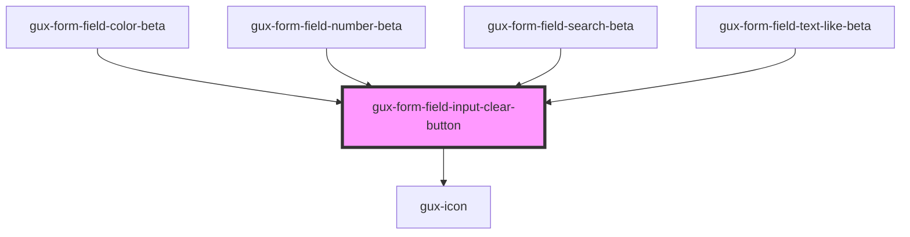

# gux-form-field-input-clear-button

<!-- Auto Generated Below -->

## Dependencies

### Used by

 - [gux-form-field-color-beta](../../components/gux-form-field-color)
 - [gux-form-field-number-beta](../../components/gux-form-field-number)
 - [gux-form-field-search-beta](../../components/gux-form-field-search)
 - [gux-form-field-text-like-beta](../../components/gux-form-field-text-like)

### Depends on

- [gux-icon](../../../../stable/gux-icon)

### Graph

----------------------------------------------

*Built with [StencilJS](https://stenciljs.com/)*
