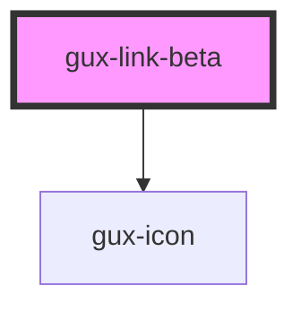

# gux-link

<!-- Auto Generated Below -->

## Properties

| Property         | Attribute          | Description                                          | Type                                         | Default     |
| ---------------- | ------------------ | ---------------------------------------------------- | -------------------------------------------- | ----------- |
| `href`           | `href`             | The href                                             | `string`                                     | `undefined` |
| `isExternalLink` | `is-external-link` | Show external icon if external link                  | `boolean`                                    | `false`     |
| `linkText`       | `link-text`        | The text for the link                                | `string`                                     | `undefined` |
| `tableCellLink`  | `table-cell-link`  | True when link component is used within a table cell | `boolean`                                    | `false`     |
| `target`         | `target`           | Where to open the link                               | `"_blank" \| "_parent" \| "_self" \| "_top"` | `'_self'`   |

## Dependencies

### Depends on

- [gux-icon](../../stable/gux-icon)

### Graph

----------------------------------------------

*Built with [StencilJS](https://stenciljs.com/)*
