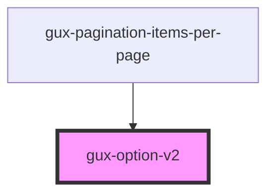

# gux-option-v2

<!-- Auto Generated Below -->

## Properties

| Property   | Attribute  | Description | Type      | Default     |
| ---------- | ---------- | ----------- | --------- | ----------- |
| `active`   | `active`   |             | `boolean` | `false`     |
| `disabled` | `disabled` |             | `boolean` | `false`     |
| `filtered` | `filtered` |             | `boolean` | `false`     |
| `hovered`  | `hovered`  |             | `boolean` | `false`     |
| `selected` | `selected` |             | `boolean` | `false`     |
| `value`    | `value`    |             | `string`  | `undefined` |

## Dependencies

### Used by

 - [gux-pagination-items-per-page](../../../stable/gux-pagination/gux-pagination-items-per-page)

### Graph

----------------------------------------------

*Built with [StencilJS](https://stenciljs.com/)*
