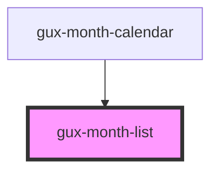

# gux-month-list

<!-- Auto Generated Below -->

## Methods

### `guxFocusFirstItem() => Promise<void>`

#### Returns

Type: `Promise<void>`

## Slots

| Slot           | Description |
| -------------- | ----------- |
| `"month name"` |             |

## Dependencies

### Used by

 - [gux-month-calendar](..)

### Graph

----------------------------------------------

*Built with [StencilJS](https://stenciljs.com/)*
