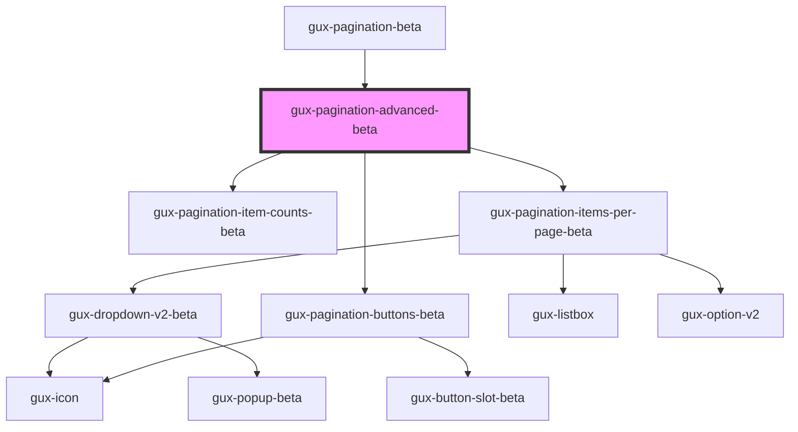

# gux-pagination-advanced-beta

<!-- Auto Generated Below -->

## Properties

| Property       | Attribute        | Description                                                                   | Type                    | Default |
| -------------- | ---------------- | ----------------------------------------------------------------------------- | ----------------------- | ------- |
| `currentPage`  | `current-page`   | The currently select page. Changes are watched by the component.              | `number`                | `1`     |
| `itemsPerPage` | `items-per-page` | The max number of items on a page. Used to calculate total page count         | `100 \| 25 \| 50 \| 75` | `25`    |
| `pagesUnknown` | `pages-unknown`  | True when the total number of pages is unknown.                               | `boolean`               | `false` |
| `totalItems`   | `total-items`    | The total number of items in the data set. Used to calculate total page count | `number`                | `0`     |

## Events

| Event                 | Description | Type                                                          |
| --------------------- | ----------- | ------------------------------------------------------------- |
| `guxpaginationchange` |             | `CustomEvent<{ currentPage: number; itemsPerPage: number; }>` |

## Dependencies

### Used by

 - [gux-pagination-beta](..)

### Depends on

- [gux-pagination-item-counts-beta](../gux-pagination-item-counts-beta)
- [gux-pagination-items-per-page-beta](../gux-pagination-items-per-page-beta)
- [gux-pagination-buttons-beta](../gux-pagination-buttons-beta)

### Graph

----------------------------------------------

*Built with [StencilJS](https://stenciljs.com/)*
