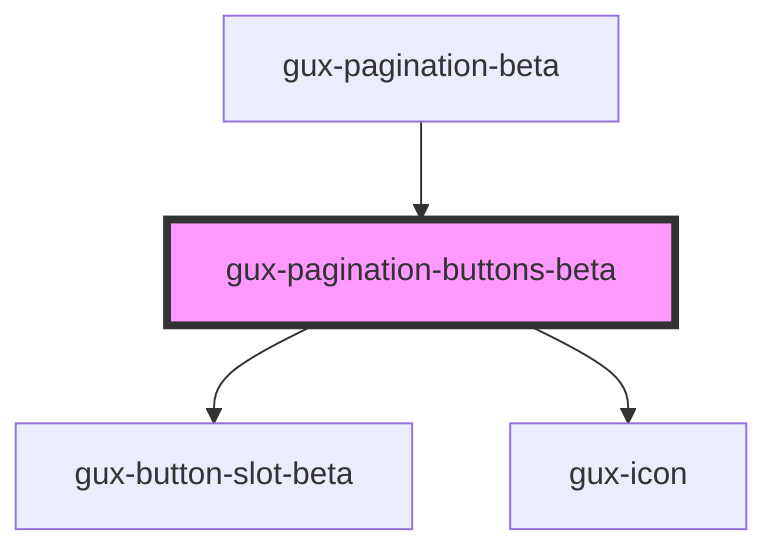

# gux-pagination-buttons

An internal component used by the gux-pagination component.

<!-- Auto Generated Below -->

## Properties

| Property      | Attribute      | Description | Type                     | Default      |
| ------------- | -------------- | ----------- | ------------------------ | ------------ |
| `currentPage` | `current-page` |             | `number`                 | `undefined`  |
| `layout`      | `layout`       |             | `"advanced" \| "simple"` | `'advanced'` |
| `totalPages`  | `total-pages`  |             | `number`                 | `undefined`  |

## Events

| Event                       | Description | Type                  |
| --------------------------- | ----------- | --------------------- |
| `internalcurrentpagechange` |             | `CustomEvent<number>` |

## Dependencies

### Used by

 - [gux-pagination-beta](..)

### Depends on

- [gux-button-slot-beta](../../gux-button-slot)
- [gux-icon](../../../stable/gux-icon)

### Graph

----------------------------------------------

*Built with [StencilJS](https://stenciljs.com/)*
