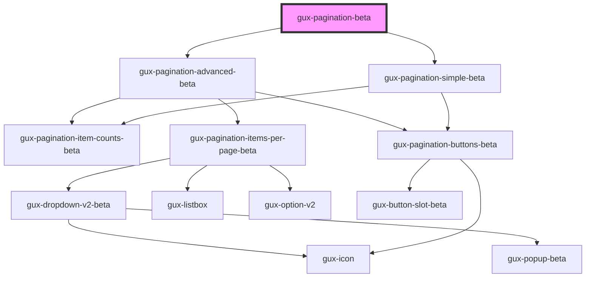

# gux-pagination

A pagination control intended to be used underneath a table or grid with paged
content. Given a total number of items, the view will automatically calculate
a total number of pages (you can optionally supply the number of items per page
and/or initial starting page).

When a user changes pages, the component will emit a `guxpaginationchange` event with
the pagination state.

<!-- Auto Generated Below -->

## Properties

| Property       | Attribute        | Description                                                                     | Type                     | Default      |
| -------------- | ---------------- | ------------------------------------------------------------------------------- | ------------------------ | ------------ |
| `currentPage`  | `current-page`   | The currently select page. Changes are watched by the component.                | `number`                 | `1`          |
| `itemsPerPage` | `items-per-page` | The max number of items on a page. Used to calculate total page count           | `100 \| 25 \| 50 \| 75`  | `25`         |
| `layout`       | `layout`         | The pagination component can have different layouts to suit the available space | `"advanced" \| "simple"` | `'advanced'` |
| `pagesUnknown` | `pages-unknown`  | True when the total number of pages is unknown.                                 | `boolean`                | `false`      |
| `totalItems`   | `total-items`    | The total number of items in the data set. Used to calculate total page count   | `number`                 | `0`          |

## Dependencies

### Depends on

- [gux-pagination-advanced-beta](gux-pagination-advanced-beta)
- [gux-pagination-simple-beta](gux-pagination-simple-beta)

### Graph

----------------------------------------------

*Built with [StencilJS](https://stenciljs.com/)*
