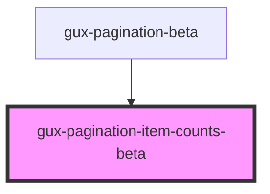

# gux-pagination-item-counts

An internal component used by the gux-pagination component.

<!-- Auto Generated Below -->

## Properties

| Property       | Attribute        | Description | Type      | Default |
| -------------- | ---------------- | ----------- | --------- | ------- |
| `currentPage`  | `current-page`   |             | `number`  | `0`     |
| `itemsPerPage` | `items-per-page` |             | `number`  | `25`    |
| `pagesUnknown` | `pages-unknown`  |             | `boolean` | `false` |
| `totalItems`   | `total-items`    |             | `number`  | `0`     |

## Dependencies

### Used by

 - [gux-pagination-beta](..)

### Graph

----------------------------------------------

*Built with [StencilJS](https://stenciljs.com/)*
