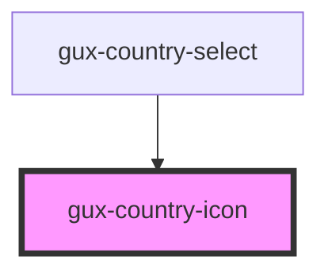

# gux-country-icon

<!-- Auto Generated Below -->

## Properties

| Property      | Attribute      | Description | Type     | Default     |
| ------------- | -------------- | ----------- | -------- | ----------- |
| `countryCode` | `country-code` |             | `string` | `undefined` |
| `countryName` | `country-name` |             | `string` | `undefined` |

## Dependencies

### Used by

 - [gux-country-select](../gux-country-select)

### Graph

----------------------------------------------

*Built with [StencilJS](https://stenciljs.com/)*
