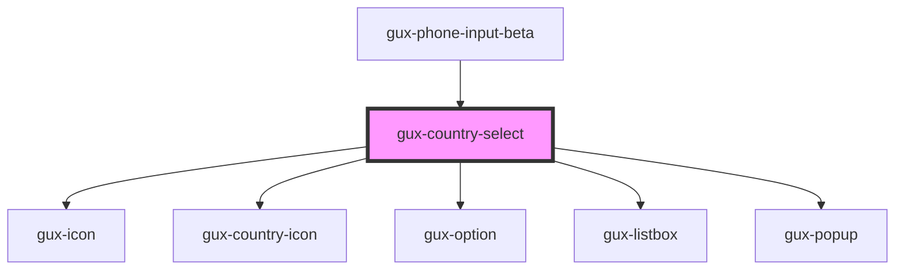

# gux-country-select

<!-- Auto Generated Below -->

## Properties

| Property   | Attribute  | Description | Type      | Default     |
| ---------- | ---------- | ----------- | --------- | ----------- |
| `disabled` | `disabled` |             | `boolean` | `false`     |
| `labelId`  | `label-id` |             | `string`  | `undefined` |
| `region`   | `region`   |             | `string`  | `undefined` |

## Events

| Event                   | Description | Type               |
| ----------------------- | ----------- | ------------------ |
| `internalregionupdated` |             | `CustomEvent<any>` |

## Dependencies

### Used by

 - [gux-phone-input-beta](../..)

### Depends on

- [gux-icon](../../../../stable/gux-icon)
- [gux-country-icon](../gux-country-icon)
- [gux-option](../../../../stable/gux-listbox/gux-option)
- [gux-listbox](../../../../stable/gux-listbox)
- [gux-popup](../../../../stable/gux-popup)

### Graph

----------------------------------------------

*Built with [StencilJS](https://stenciljs.com/)*
