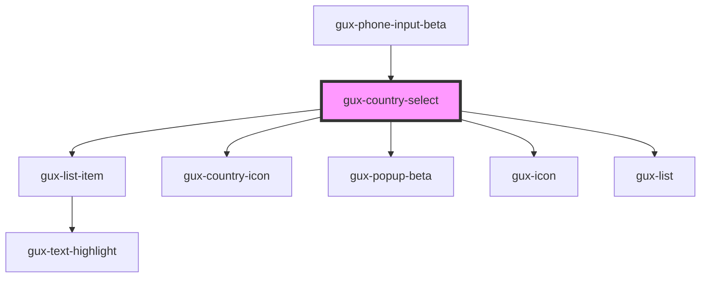

# gux-country-select

<!-- Auto Generated Below -->

## Properties

| Property         | Attribute         | Description | Type     | Default     |
| ---------------- | ----------------- | ----------- | -------- | ----------- |
| `countryCode`    | `country-code`    |             | `string` | `undefined` |
| `defaultCountry` | `default-country` |             | `string` | `undefined` |

## Dependencies

### Used by

 - [gux-phone-input-beta](../..)

### Depends on

- [gux-list-item](../../../../stable/gux-list/list-item)
- [gux-country-icon](../gux-country-icon)
- [gux-popup-beta](../../../gux-popup)
- [gux-icon](../../../../stable/gux-icon)
- [gux-list](../../../../stable/gux-list)

### Graph

----------------------------------------------

*Built with [StencilJS](https://stenciljs.com/)*
