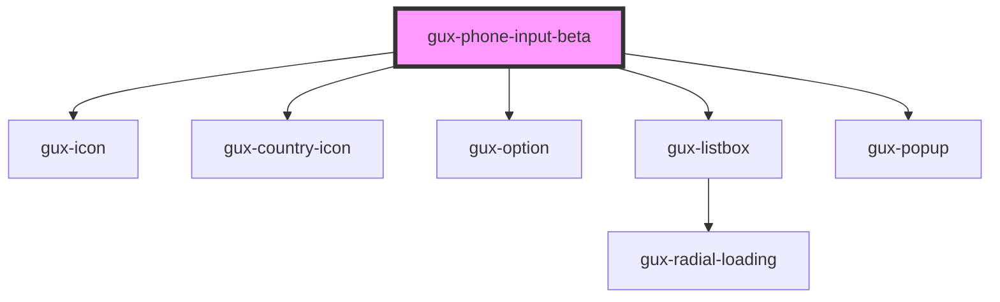

# gux-phone-input

Input for international phone numbers

<!-- Auto Generated Below -->

## Properties

| Property        | Attribute        | Description | Type      | Default     |
| --------------- | ---------------- | ----------- | --------- | ----------- |
| `defaultRegion` | `default-region` |             | `string`  | `'US'`      |
| `disabled`      | `disabled`       |             | `boolean` | `false`     |
| `hasError`      | `has-error`      |             | `boolean` | `false`     |
| `labelId`       | `label-id`       |             | `string`  | `undefined` |
| `required`      | `required`       |             | `boolean` | `undefined` |
| `value`         | `value`          |             | `string`  | `undefined` |

## Events

| Event                   | Description | Type                   |
| ----------------------- | ----------- | ---------------------- |
| `input`                 |             | `CustomEvent<string>`  |
| `internalError`         |             | `CustomEvent<boolean>` |
| `internalregionupdated` |             | `CustomEvent<any>`     |

## Dependencies

### Depends on

- [gux-icon](../../stable/gux-icon)
- [gux-country-icon](./components/gux-country-icon)
- [gux-option](../../stable/gux-listbox/gux-option)
- [gux-listbox](../../stable/gux-listbox)
- [gux-popup](../../stable/gux-popup)

### Graph

----------------------------------------------

*Built with [StencilJS](https://stenciljs.com/)*
