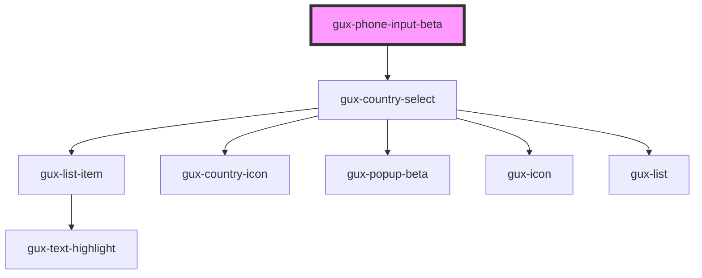

# gux-phone-input

Input for international phone numbers

<!-- Auto Generated Below -->

## Properties

| Property | Attribute | Description | Type     | Default     |
| -------- | --------- | ----------- | -------- | ----------- |
| `value`  | `value`   |             | `string` | `undefined` |

## Dependencies

### Depends on

- [gux-country-select](./components/gux-country-select)

### Graph

----------------------------------------------

*Built with [StencilJS](https://stenciljs.com/)*
