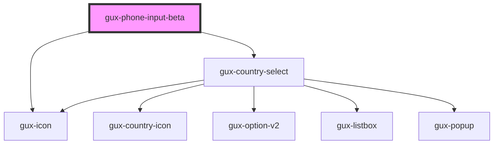

# gux-phone-input

Input for international phone numbers

<!-- Auto Generated Below -->

## Properties

| Property        | Attribute        | Description | Type                                    | Default     |
| --------------- | ---------------- | ----------- | --------------------------------------- | ----------- |
| `defaultRegion` | `default-region` |             | `string`                                | `'us'`      |
| `labelPosition` | `label-position` |             | `"above" \| "beside" \| "screenreader"` | `undefined` |
| `labelText`     | `label-text`     |             | `string`                                | `undefined` |
| `value`         | `value`          |             | `string`                                | `undefined` |

## Events

| Event          | Description | Type               |
| -------------- | ----------- | ------------------ |
| `phoneUpdated` |             | `CustomEvent<any>` |

## Dependencies

### Depends on

- [gux-country-select](./components/gux-country-select)
- [gux-icon](../../stable/gux-icon)

### Graph

----------------------------------------------

*Built with [StencilJS](https://stenciljs.com/)*
