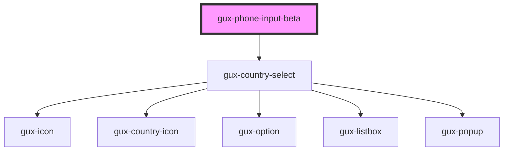

# gux-phone-input

Input for international phone numbers

<!-- Auto Generated Below -->

## Properties

| Property        | Attribute        | Description | Type                                    | Default     |
| --------------- | ---------------- | ----------- | --------------------------------------- | ----------- |
| `defaultRegion` | `default-region` |             | `string`                                | `'us'`      |
| `labelPosition` | `label-position` |             | `"above" \| "beside" \| "screenreader"` | `undefined` |
| `value`         | `value`          |             | `string`                                | `undefined` |

## Events

| Event   | Description | Type                   |
| ------- | ----------- | ---------------------- |
| `error` |             | `CustomEvent<boolean>` |
| `input` |             | `CustomEvent<string>`  |

## Dependencies

### Depends on

- [gux-country-select](./components/gux-country-select)

### Graph

----------------------------------------------

*Built with [StencilJS](https://stenciljs.com/)*
