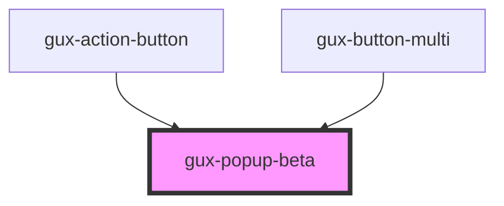

# gux-popup-beta

<!-- Auto Generated Below -->

## Properties

| Property   | Attribute  | Description | Type      | Default |
| ---------- | ---------- | ----------- | --------- | ------- |
| `disabled` | `disabled` |             | `boolean` | `false` |
| `expanded` | `expanded` |             | `boolean` | `false` |

## Events

| Event               | Description                                                          | Type                |
| ------------------- | -------------------------------------------------------------------- | ------------------- |
| `internalcollapsed` | This event will run when the popup transitions to a collapsed state. | `CustomEvent<void>` |
| `internalexpanded`  | This event will run when the popup transitions to an expanded state. | `CustomEvent<void>` |

## Slots

| Slot       | Description              |
| ---------- | ------------------------ |
| `"popup"`  | Required slot for popup  |
| `"target"` | Required slot for target |

## Dependencies

### Used by

 - [gux-action-button](../../stable/gux-action-button)
 - [gux-button-multi](../../stable/gux-button-multi)

### Graph

----------------------------------------------

*Built with [StencilJS](https://stenciljs.com/)*
