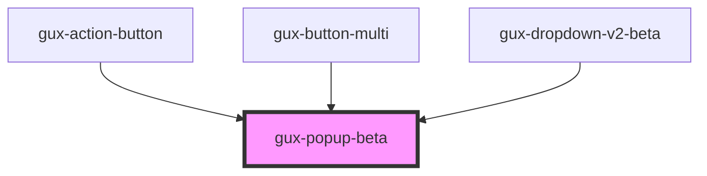

# gux-input

<!-- Auto Generated Below -->

## Properties

| Property   | Attribute  | Description | Type      | Default |
| ---------- | ---------- | ----------- | --------- | ------- |
| `disabled` | `disabled` |             | `boolean` | `false` |
| `expanded` | `expanded` |             | `boolean` | `false` |

## Slots

| Slot       | Description              |
| ---------- | ------------------------ |
| `"popup"`  | Required slot for popup  |
| `"target"` | Required slot for target |

## Dependencies

### Used by

 - [gux-action-button](../../stable/gux-action-button)
 - [gux-button-multi](../gux-button-multi)
 - [gux-dropdown-v2-beta](../gux-dropdown-v2)

### Graph

----------------------------------------------

*Built with [StencilJS](https://stenciljs.com/)*
