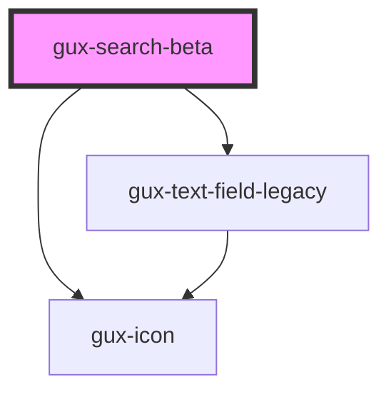

# gux-search

The gux-search control is a styled-replacement of the 'search'-type input HTML element.  Currently only
performs a search request when the 'return' key is pressed.

<!-- Auto Generated Below -->

## Properties

| Property        | Attribute        | Description                                                                                                                           | Type      | Default     |
| --------------- | ---------------- | ------------------------------------------------------------------------------------------------------------------------------------- | --------- | ----------- |
| `disabled`      | `disabled`       | Disable the input and prevent interactions.                                                                                           | `boolean` | `false`     |
| `dynamicSearch` | `dynamic-search` | Operate the search control using dynamic searching as the input value is updated.  Searches debounced to execute every searchTimeout. | `boolean` | `false`     |
| `placeholder`   | `placeholder`    | The input placeholder.                                                                                                                | `string`  | `undefined` |
| `searchTimeout` | `search-timeout` | Timeout between input and search.                                                                                                     | `number`  | `500`       |
| `srLabel`       | `sr-label`       | Aria label for the search box.                                                                                                        | `string`  | `undefined` |
| `value`         | `value`          | Indicate the input search value                                                                                                       | `string`  | `''`        |

## Events

| Event    | Description                                           | Type               |
| -------- | ----------------------------------------------------- | ------------------ |
| `input`  | Triggered when the user inputs data into the control. | `CustomEvent<any>` |
| `search` | Triggered when a search is requested.                 | `CustomEvent<any>` |

## Methods

### `setInputFocus() => Promise<void>`

Sets the input focus to the search input.

#### Returns

Type: `Promise<void>`

### `setLabeledBy(labeledBy: string) => Promise<void>`

Provides an aria-labeledby element for this component.

#### Returns

Type: `Promise<void>`

## Dependencies

### Depends on

- [gux-text-field-legacy](../../legacy/gux-text-field-legacy)
- [gux-icon](../../stable/gux-icon)

### Graph

----------------------------------------------

*Built with [StencilJS](https://stenciljs.com/)*
