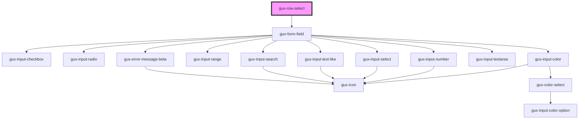

# gux-row-select

<!-- Auto Generated Below -->

## Properties

| Property   | Attribute  | Description | Type      | Default |
| ---------- | ---------- | ----------- | --------- | ------- |
| `selected` | `selected` |             | `boolean` | `false` |

## Events

| Event                     | Description | Type               |
| ------------------------- | ----------- | ------------------ |
| `internalrowselectchange` |             | `CustomEvent<any>` |

## Dependencies

### Depends on

- [gux-form-field](../../../stable/gux-form-field)

### Graph

----------------------------------------------

*Built with [StencilJS](https://stenciljs.com/)*
