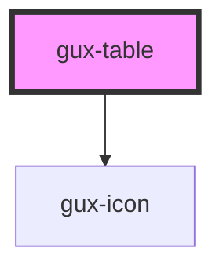

# gux-table

<!-- Auto Generated Below -->

## Properties

| Property       | Attribute       | Description                                                      | Type      | Default     |
| -------------- | --------------- | ---------------------------------------------------------------- | --------- | ----------- |
| `compact`      | `compact`       | Indicates table row density style                                | `boolean` | `false`     |
| `emptyMessage` | `empty-message` | Represents info message that should be displayed for empty table | `string`  | `undefined` |
| `objectTable`  | `object-table`  | Indicates that object table specific styles should be applied    | `boolean` | `false`     |

## Events

| Event         | Description                                               | Type               |
| ------------- | --------------------------------------------------------- | ------------------ |
| `sortChanged` | Triggers when the sorting of the table column is changed. | `CustomEvent<any>` |

## Dependencies

### Depends on

- [gux-icon](../../stable/gux-icon)

### Graph

----------------------------------------------

*Built with [StencilJS](https://stenciljs.com/)*
