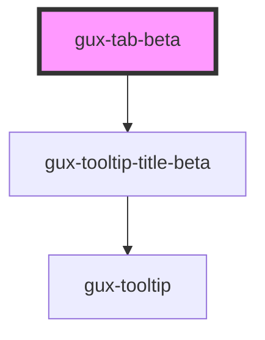

# gux-tabs-list

<!-- Auto Generated Below -->

## Properties

| Property      | Attribute      | Description | Type      | Default     |
| ------------- | -------------- | ----------- | --------- | ----------- |
| `guxDisabled` | `gux-disabled` |             | `boolean` | `false`     |
| `iconOnly`    | `icon-only`    |             | `boolean` | `false`     |
| `tabId`       | `tab-id`       |             | `string`  | `undefined` |

## Events

| Event                      | Description | Type                  |
| -------------------------- | ----------- | --------------------- |
| `internalactivatetabpanel` |             | `CustomEvent<string>` |

## Methods

### `guxFocus() => Promise<void>`

#### Returns

Type: `Promise<void>`

### `guxSetActive(active: boolean) => Promise<void>`

#### Returns

Type: `Promise<void>`

## Dependencies

### Depends on

- [gux-tooltip-title-beta](../../gux-tooltip-title)

### Graph

----------------------------------------------

*Built with [StencilJS](https://stenciljs.com/)*
